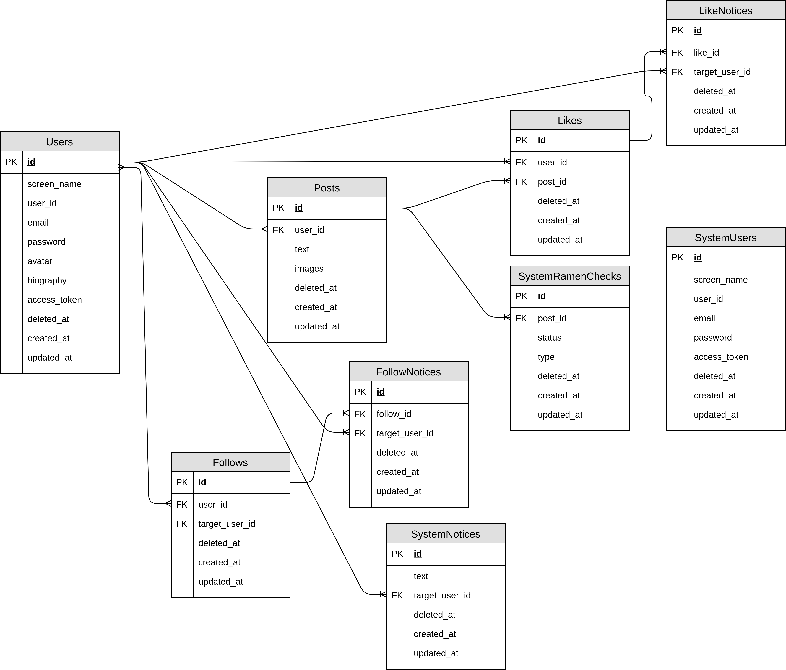

# DB設計

### usres
- 一般ユーザー

|カラム名|型|長さ|属性|説明|
|:--|:--|:--|:--|:--|
|id|increments|-|primary|数値のID. システムによる自動割り当て|
|screen_name|string|16|-|ユーザー表示名. 日本語可|
|user_id|string|16|unique|ユーザーが任意に設定できるID. 半角英数字のみ|
|email|string|256|unique|ユーザーのメールアドレス|
|password|string|-|-|bcryptによってハッシュ化されたパスワード|
|avatar|string|-|-|ユーザーのアイコン画像のパス|
|biography|string|128|-|ユーザーの自己紹介欄|
|access_token|string|-|nullable|アクセストークン|
|deleted_at|timestamp|-|nullable|退会した日付(論理削除)|
|created_at|timestamps|-|-|作成された日付. Laravelによってデフォルトで生成される|
|updated_at|timestamps|-|-|更新された日付. Laravelによってデフォルトで生成される|

### system_users
- 管理ユーザー

|カラム名|型|長さ|属性|説明|
|:--|:--|:--|:--|:--|
|id|increments|-|primary|数値のID. システムによる自動割り当て|
|screen_name|string|16|-|ユーザー表示名. 日本語可|
|user_id|string|16|unique|ユーザーが任意に設定できるID. 半角英数字のみ|
|email|string|256|unique|ユーザーのメールアドレス|
|password|string|-|-|bcryptによってハッシュ化されたパスワード|
|access_token|string|-|nullable|アクセストークン|
|deleted_at|timestamp|-|nullable|退会した日付(論理削除)|
|created_at|timestamps|-|-|作成された日付. Laravelによってデフォルトで生成される|
|updated_at|timestamps|-|-|更新された日付. Laravelによってデフォルトで生成される|

### posts
- 投稿データ

|カラム名|型|長さ|属性|説明|
|:--|:--|:--|:--|:--|
|id|increments|-|primary|数値のID. ユーザーによる変更が不可|
|user_id|unsignedBigInteger|-|references|ユーザーID|
|text|string|256|-|投稿内容(テキスト)|
|images|json|-|-|投稿内容(画像)のパス. 最大４枚のためJSONとして持つ|
|deleted_at|timestamp|-|nullable|退会した日付(論理削除)|
|created_at|timestamps|-|-|作成された日付. Laravelによってデフォルトで生成される|
|updated_at|timestamps|-|-|更新された日付. Laravelによってデフォルトで生成される|

### follows
- ユーザーのフォロー

|カラム名|型|長さ|属性|説明|
|:--|:--|:--|:--|:--|
|id|increments|-|primary|数値のID. ユーザーによる変更が不可|
|user_id|unsignedBigInteger|-|references|フォローするユーザーのID|
|target_user_id|unsignedBigInteger|-|references|フォロー対象のユーザーID|
|deleted_at|timestamp|-|nullable|退会した日付(論理削除)|
|created_at|timestamps|-|-|作成された日付. Laravelによってデフォルトで生成される|
|updated_at|timestamps|-|-|更新された日付. Laravelによってデフォルトで生成される|

### likes
- 投稿に対するいいね

|カラム名|型|長さ|属性|説明|
|:--|:--|:--|:--|:--|
|id|increments|-|primary|数値のID. ユーザーによる変更が不可|
|user_id|unsignedBigInteger|-|references|いいねしたユーザーのID|
|post_id|unsignedBigInteger|-|references|いいねする投稿のID|
|deleted_at|timestamp|-|nullable|退会した日付(論理削除)|
|created_at|timestamps|-|-|作成された日付. Laravelによってデフォルトで生成される|
|updated_at|timestamps|-|-|更新された日付. Laravelによってデフォルトで生成される|

### like_notices
- いいねの通知

|カラム名|型|長さ|属性|説明|
|:--|:--|:--|:--|:--|
|id|increments|-|primary|数値のID. ユーザーによる変更が不可|
|like_id|unsignedBigInteger|-|references|対象となるいいねのID|
|target_user_id|unsignedBigInteger|-|references|通知の送信先ユーザーID|
|deleted_at|timestamp|-|nullable|退会した日付(論理削除)|
|created_at|timestamps|-|-|作成された日付. Laravelによってデフォルトで生成される|
|updated_at|timestamps|-|-|更新された日付. Laravelによってデフォルトで生成される|

### follow_notices
- フォローの通知

|カラム名|型|長さ|属性|説明|
|:--|:--|:--|:--|:--|
|id|increments|-|primary|数値のID. ユーザーによる変更が不可|
|like_id|unsignedBigInteger|-|references|対象となるフォローのID|
|target_user_id|unsignedBigInteger|-|references|通知の送信先ユーザーID|
|deleted_at|timestamp|-|nullable|退会した日付(論理削除)|
|created_at|timestamps|-|-|作成された日付. Laravelによってデフォルトで生成される|
|updated_at|timestamps|-|-|更新された日付. Laravelによってデフォルトで生成される|

### system_notices
- 運営からの通知

|カラム名|型|長さ|属性|説明|
|:--|:--|:--|:--|:--|
|id|increments|-|primary|数値のID. ユーザーによる変更が不可|
|text|string|256|-|送信内容|
|target_user_id|unsignedBigInteger|-|references, nullable|対象となるユーザーID. ただし運営からの通知はブロードキャストが基本なので基本的に使用しない|
|deleted_at|timestamp|-|nullable|退会した日付(論理削除)|
|created_at|timestamps|-|-|作成された日付. Laravelによってデフォルトで生成される|
|updated_at|timestamps|-|-|更新された日付. Laravelによってデフォルトで生成される|

### system_ramen_checks
- ユーザーから報告されたラーメン画像じゃないよ報告の承認

|カラム名|型|長さ|属性|説明|
|:--|:--|:--|:--|:--|
|id|increments|-|primary|数値のID. ユーザーによる変更が不可|
|post_id|unsignedBigInteger|references|対象となる投稿のID|
|status|string|16|-|承認の状態. YET(まだ)/REJECT(拒否された)/ACCEPT(受理された)|
|type|string|16|-|報告の種類. 今後の拡張性を考えて持たせてある|
|deleted_at|timestamp|-|nullable|退会した日付(論理削除)|
|created_at|timestamps|-|-|作成された日付. Laravelによってデフォルトで生成される|
|updated_at|timestamps|-|-|更新された日付. Laravelによってデフォルトで生成される|

# E-R図
