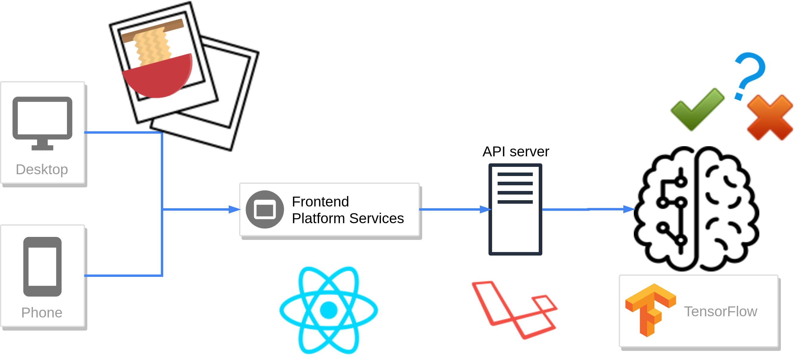

## そもそもMenstagramって何？
**SUSURU FOREVER, SUSURU ANYWHERE**というスローガンの下, 世界中のラーメンコミュニティを盛り上げることを目標に開発しているサービスです.

## なんでこのサービスを作るの？
開発者である[僕たち](./members.md)が**ラーメンを愛してやまない**からです.  
他にも, ラーメンが若年層を中心に人気であることや, 多種多様な宗派やスタイルが存在しているという面白さがあるというのもあります.

## Menstagramの由来は？
ra**MEN** **STA**tus photo**GRA**ph **M**emoriesの略称から生まれた造語です.

## ラーメンよりもフォトジェニックが好きなんですけど？
そんなあなたには https://www.instagram.com/ がオススメです.

## どんな機能があるの？
投稿機能, タイムライン機能, フォロー機能, いいね機能などです.  
ちなみにMenstagramの世界では投稿は「**スラープ**」, いいねは「**ヤム**」と言います.

詳しくは[用語集](./terms.md)を参照.

## ラーメンだけって言ってもえっちな写真を投稿するユーザーいるんじゃないの？
ご心配には及びません.
我々お手製の**ラーメン判定AI**が無関係な写真は**🙅ブロック🙅**します.

ただしラーメン判定AIはまだまだ発展途上のため, うどんの投稿を許してしまうかもしれません.  
ラーメン判定AIがスパムユーザーを駆逐するその日までは, 我々ユーザーでクリーンな環境を作っていきましょう！

ちなみに現在の認識率はざっとこんな感じです.

||ラーメンと判断する確率|ラーメンでないと判断する確率|
|:--|:-:|:-:|
|ラーメン|90%|10%|
|それ以外|75%|25%|

## どういうしくみで動いているの？
ざっくりとこんなかんじ.

詳しくは[技術選定](./tech.md)を参照.

---

**Menstagramに興味が湧きましたか？**  
**早速登録してあなたも世界中のメンスタグラマー達とラーメンの汁よりも濃い時間を過ごしましょう！**  

**開発者としての参加も大歓迎です！**  
**まだまだ[足りない機能](https://github.com/orgs/uyupun/projects/1)があります！**
