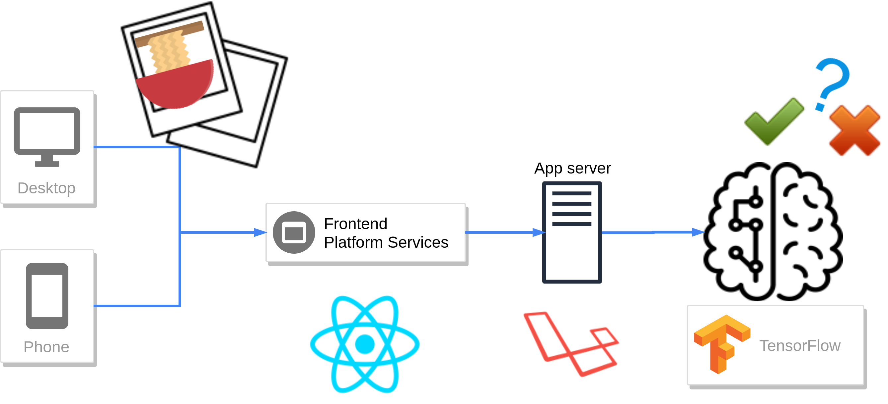

# Menstagramとはなんなのか

- **🍜 SUSURU FOREVER, SUSURU ANYWHERE 🍜**
- 世界中のラーメンコミュニティを支える特化型SNSという立ち位置を目指して開発している
- Menstagramは ra**MEN** **STA**tus photo**GRA**ph **M**emories の略称

# このサービスを作る理由

- **僕たちがラーメンを愛しているから**
- 今、若者に最も希求力のある食材だと考えているから
- 食材にも関わらず、多種多様な宗派やスタイルが存在しているという面白さがあるから
- AIを主要な機能として組み込むSNSの真新しさ

# 真面目な説明が欲しい方へ

## Menstagramとは？

ラーメンの写真共有に特化したSNSで、

### ra**MEN** **STA**tus photo**GRA**ph **M**emories 

の略称から作成した造語です。

## ターゲットは？

10代〜30代(若者)を始めとする、ラーメンのことを好きな人たちです。

## なぜ若者をターゲットに？

企画者の私達と近しく、普段からSNSに慣れ親しんだ層であるため、我々が新たに作るSNSにも適応しやすいと考えたからです。

## なぜラーメン？

え？あなたはラーメンをお好きでない？そりゃ残念。

## ラーメンだけって言ってても違う写真投稿するユーザー居そうだよ？

ご心配には及びません。我々お手製の **ラーメン判定AI** が、無関係な写真はブロック！🙅します。

現在の認識率はだいたいこれぐらいです。

|投入データ|ラーメンと判断する確率|1-(ラーメンと判断する確率)|
|:--------:|:---------------------:|:------------------------|
|ラーメン|90%|15%|
|それ以外|75%|25%|

##### ラーメンの判定が緩い?でもこう考えてみてください。「ラーメンを受け入れる間口は広くあるべき」。そうでしょう？

## どういう感じでデータが流れてるの？

こんなかんじ

## ユーザーに与える体験

Menstagramは、ユーザー体験を4段階に分けて捉えています。

1. **腹減り期**

「お腹が空いてちからが出ない」状態です。Menstagramの存在を知ります。

2. **見てみる期**

世界中のユーザーのラーメン写真を見て余計に腹が減る状態です。

3. **食べる期**

我慢できなくなり自分もラーメンを食べます。その際撮影した写真をMenstagramに **スラープ(=投稿)** してみます。

4. **満腹期**

食事に満足した頃に他のユーザーからの **ヤム(=いいね)** が!承認される幸福感を与え、「他のお店も行ってみよう」という感情を演出します。

## 興味が出てきましたか？早速 [登録]() して、あなたも世界中のラーメンコミュニティに入りましょう!
