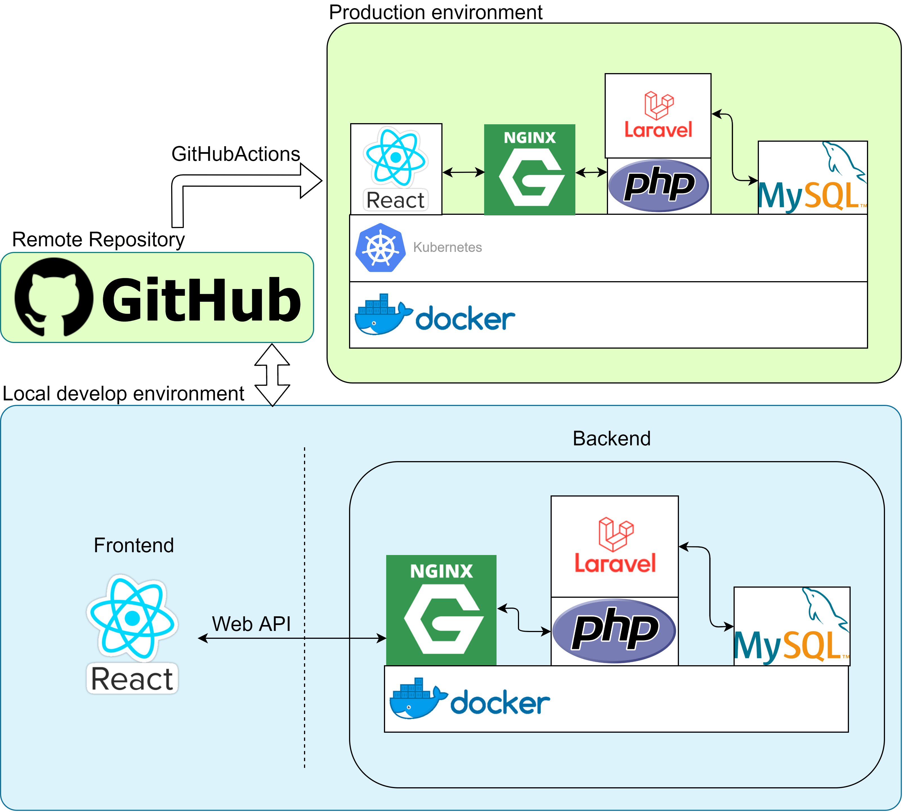

# 技術選定

### フロントエンド
|技術名|使用用途|選定理由|
|:--|:--|:--|
|React|Webフロントエンド|Reactのカスタマイズ性の高さに可能性を感じたため|
|Redux|状態管理|Reactでの大規模開発にも対応するため|
|Jest|コンポーネントテスト, インテグレーションテスト|Reactと最も親和性の高いテストフレームワークだと感じたため|
|Sass(scss記法)|CSSの代替|CSSの不自由な記法から開放されるため|
|Bootstrap|CSSの補助|グリッドシステム等, 有用な機能が備わっているため. カスタマイズを前提として使用する|
|XD|カンプ|実装前に全画面のレイアウトを見渡せると便利なため|

その他検討中の技術
- RxJS

### バックエンド
|技術名|使用用途|選定理由|
|:--|:--|:--|
|Laravel|Web API|開発メンバーがPHP/Laravelに慣れているため. また, Laravel 6の新機能やPHP 7を意識したコーディングを取り入れてみたいため|
|PHPUnit|テスト|Laravelと最も親和性の高いテストフレームワークだと感じたため|
|MySQL|マスタDB|開発メンバーが最も慣れているRDBのため|
|Redis|キャッシュ|高速な検索処理等が求められる場合にMySQLでは補えない部分を補うため|
|nginx|Webサーバ|一般的にApacheよりもパフォーマンスが高いため|

また, Web APIは極力RESTを意識する

### インフラ
|技術名|使用用途|選定理由|
|:--|:--|:--|
|Git|ソースコード管理|VCSの中でデファクトの地位を築いているため|
|GitHub|ソースコードの共有|開発メンバーが最も慣れており, かつ, 求める機能が数多く実装されているため|
|Docker|Docker Compose/Kubernetesの基礎技術|コンテナ仮想化技術の中でデファクトの地位を築いているため|
|Docker Compose|開発環境でのインフラ構築|開発環境にKubernetesを使用するのはあまりにコストが高いと判断したため|
|Kubernetes|本番環境でのインフラ構築|コンテナオーケストレーションツールの中でデファクトの地位を築いているため|
|GitHub Actions|CI/CD|無料プランの場合, Circle CI等の他のCIよりもコスパが良いと判断したため|

### AI
|技術名|使用用途|選定理由|
|:--|:--|:--|
|Keras|画像判定|他の機械学習ライブラリと比べて, 学習コストが低いと判断したため|

その他検討中の技術
- PythonのWebフレームワーク何か

### その他
- アジャイル

# 技術構成

