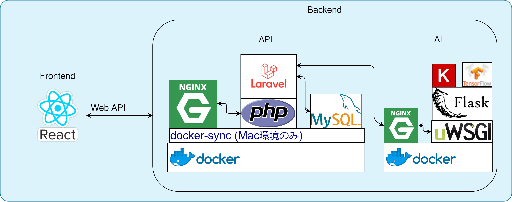

# 技術選定
技術選定は学習コストを許容範囲内に抑えつつ, できる限り新しいことにも挑戦できるよう議論した結果決定した.  
また, 開発手法や規模感・近年の流行等も視野に入れて決定した.

### デザイン
|技術名|使用用途|選定理由|
|:--|:--|:--|
|XD|カンプ|画面のレイアウトを作る上で便利なため|
|Illustrator|ロゴ, キービジュアル|高品質なデザインが可能なため|
|draw.io|図|図の作成に便利なため|

### フロントエンド
|技術名|使用用途|選定理由|
|:--|:--|:--|
|React|Webフロントエンド|Reactのカスタマイズ性の高さに可能性を感じたため|
|Redux|状態管理|Reactでの大規模開発にも対応するため|
|Jest|コンポーネントテスト, インテグレーションテスト|Reactと最も親和性の高いテストフレームワークだと感じたため|
|Sass(scss記法)|CSSの代替|CSSの不自由な記法から開放されるため|
|Bootstrap|CSSの補助|グリッドシステム等, 有用な機能が備わっているため. カスタマイズを前提として使用する|

その他検討中の技術
- RxJS
- React Hooks
- TypeScript
- Enzyme

### バックエンド
|技術名|使用用途|選定理由|
|:--|:--|:--|
|Laravel|Web API|開発メンバーがPHP/Laravelでの開発に慣れているため. できるだけRESTを心がける|
|PHPUnit|テスト|Laravelと最も親和性の高いテストフレームワークだと感じたため|
|MySQL|マスタDB|Webサービスに向いたDBMSのため|
|nginx|Webサーバ|一般的にApacheよりもパフォーマンスが高いため|

その他検討中の技術
- Redis
- GraphQL
- gRPC

### AI
|技術名|使用用途|選定理由|
|:--|:--|:--|
|Keras|ラーメン画像判定|他の機械学習ライブラリと比べて, 直感的に記述できると感じたため. ベースモデルにはVGG16を使用し, それを転移学習させて使用している|
|TensorFlow|ラーメン画像判定|Kerasのバックエンドとして使用. Kerasのバックエンドとしては一番メジャーで資料も多く, 採用実績があるため|
|Flask|Web API|主に機械学習用途であり, バックエンドと比べて規模は大きくないということを考慮し, 薄めのフレームワークを選定|
|uWSGI|WSGIサーバー|Flaskをnginxで動作させるために必要|
|nginx|Webサーバー|一般的にApacheよりもパフォーマンスが高いため|

### インフラ
|技術名|使用用途|選定理由|
|:--|:--|:--|
|Git|ソースコード管理|VCSの中でデファクトの地位を築いているため|
|GitHub|ソースコードの共有|開発メンバーが最も慣れており, かつ, 求める機能が数多く実装されているため|
|Docker|コンテナ|コンテナ仮想化技術の中でデファクトの地位を築いているため|
|Docker Compose|コンテナ|Dockerをより柔軟に使用するため|
|Travis CI|CI/CD|パブリックリポジトリの場合, CircleCIよりもコスパが良く, GitHub Actionsよりもドキュメントや資料が多いと感じたため|

その他検討中の技術
- Kubernetes
- GCP(GKE)

### モニタリング
|技術名|使用用途|選定理由|
|:--|:--|:--|
|cAdvisor|コンテナのメトリクスの収集|Prometheus環境でのコンテナのメトリクスの収集のデファクトであるため|
|Prometheus|メトリクスの収集|近年人気が上昇している監視ツールであるため|
|Grafana|メトリクスの可視化|Prometheus環境でのメトリクスの可視化のデファクトであるため|

### その他
- Agile

その他検討中の技術
- DevOps
- SRE
- GitOps

# 技術構成

